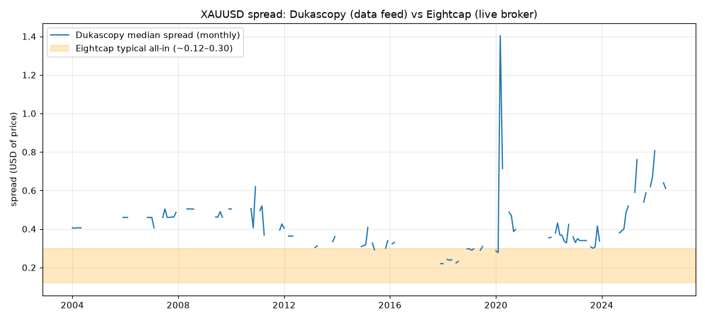
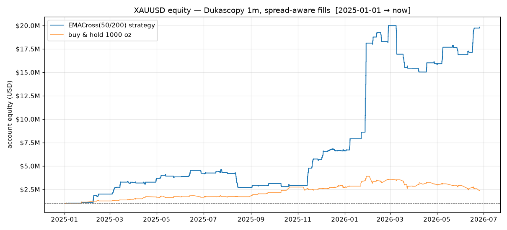
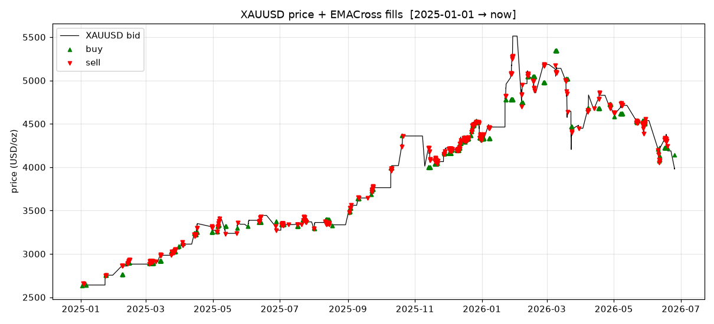

# XAU-NT-Wrangler

Download Dukascopy **XAUUSD** (gold) 1-minute history and backtest it in
[NautilusTrader](https://nautilustrader.io) with **spread-aware** fills.

```
XAU-NT-Wrangler/
├── backtest.py                     # spread-aware NautilusTrader backtest + charts
├── scripts/
│   └── download_dukascopy.sh       # parallel, resumable Dukascopy downloader → merged CSV
├── data/xauusd-m1/
│   ├── bid.csv                     # 1,275,327 bars, 2003-05-26 → 2026-06-25  (96 MB, git-ignored)
│   └── ask.csv                     # 1,215,621 bars                            (96 MB, git-ignored)
├── reports/                        # generated charts (committed)
├── requirements.txt                # nautilus-trader==1.228.0, pandas==2.3.3, matplotlib
└── README.md
```
CSV columns: `timestamp,open,high,low,close,volume` (timestamp = epoch ms, UTC).

---

## 1. Setup

NautilusTrader has **no wheels for Python 3.14**. Use [`uv`](https://docs.astral.sh/uv/)
to pin 3.13:

```bash
uv venv --python 3.13 .venv
uv pip install -r requirements.txt
```

---

## 2. Download data

```bash
#                              instrument tf from  to          price conc
./scripts/download_dukascopy.sh xauusd    m1 2003 $(date +%F)  bid   6   # → data/xauusd-m1/bid.csv
./scripts/download_dukascopy.sh xauusd    m1 2003 $(date +%F)  ask   6   # → data/xauusd-m1/ask.csv
./scripts/download_dukascopy.sh                                          # defaults (xauusd m1 2003→today bid x6)
```

One `npx dukascopy-node` process **per year**, run 6-at-a-time via `xargs -P`, each
into its own cache, then merged into a single CSV sorted by timestamp and
de-duplicated. ~23 years of 1m bars lands in **~5 min** vs the hours a single
sequential pull takes. A failed year re-runs cheaply off its cache — just run the
same command again. Output: `data/<instrument>-<tf>/<price>.csv` (+ a kept
`.cache-<price>/` for instant incremental top-ups; delete anytime).

### Data quirk that matters
Dukascopy writes a **bid** candle only in minutes the bid moved, an **ask** candle
only when the ask moved (empty minutes omitted). So the two feeds sit on
**different minute grids** — only ~252k minutes have *both*. `backtest.py` aligns
them on the union grid and forward-fills the prevailing quote (a quote persists
until it changes). Don't naively inner-join — you'd discard ~80% of the data.

---

## 3. Spread: Dukascopy (the data) vs Eightcap (live target)



The bid/ask spread in this backtest is **100% Dukascopy's** — a Swiss ECN
aggregating bank liquidity, no dealer markup, no commission baked into the quote.
**Eightcap** is a retail CFD broker; it widens the spread (Standard) or adds
commission on a near-raw spread (Raw). The chart above shows Dukascopy's monthly
median spread sits mostly **above** Eightcap's typical band — with a COVID-2020
spike to ~1.4 and a steady rise through 2025 as gold ran to ~$4000.

**Measured Dukascopy XAUUSD spread** (ask.close − bid.close, USD of price, on the
252,242 exactly-paired minutes):

| Window | mean | median | p90 |
|--------|------|--------|-----|
| 2003–2026 | 0.444 | 0.404 | 0.650 |
| 2024 | 0.435 | 0.411 | 0.570 |
| 2025 | 0.692 | 0.640 | 0.870 |
| 2026 | 0.687 | 0.670 | 0.914 |

(Wider in absolute USD when gold is expensive; as a *fraction* of price it's still
tiny. Caveat: candle close-vs-close slightly **overstates** the true tick spread —
the last bid and last ask in a minute aren't simultaneous.)

**Eightcap XAUUSD** (advertised/typical, 2026 — normalized to USD of price,
round-turn on 1.0 lot = 100 oz):

| | Raw | Standard |
|---|-----|----------|
| Raw spread | ~0.12–0.20 | ~0.16–0.30 |
| Commission | $7.00 r/t (≈0.07 USD-equiv) | none |
| **All-in r/t** | **~0.19–0.27** | **~0.16–0.30** |

**Takeaway:** Dukascopy's spread is **comparable to — even wider than** Eightcap's
quoted spread, so this backtest is *not* flattering on spread; if anything it's
conservative. The real live-vs-backtest gaps will be (a) Eightcap's **commission**
(Raw), (b) **spread blowouts** to 0.5–2.0+ USD around NFP/FOMC/illiquid hours, and
(c) **slippage** on market orders. ⚠️ The Eightcap numbers are advertised typicals
— for a go-live decision, log live spreads from an Eightcap demo over several
sessions; that's the only ground truth.

Sources: [Eightcap XAUUSD specs](https://www.eightcap.com/en/trade/xauusd/),
[Eightcap trading costs](https://www.eightcap.com/en/trading-costs/),
[BrokerChooser: Eightcap gold spread](https://brokerchooser.com/broker-reviews/eightcap-review/xauusd-spread).

### Modeling Eightcap costs (next step — not yet wired in)
`backtest.py`'s venue uses `default_fx_ccy`, which already applies a small fee. To
stress the strategy under Eightcap conditions, two knobs:
1. **Commission** — `engine.add_venue(..., fee_model=<FeeModel>)` (`FixedFeeModel`
   for the ~$3.5/side Raw commission).
2. **Wider spread** — before building quote ticks: `ask["close"] += markup/2;
   bid["close"] -= markup/2` to emulate a broker's markup.

---

## 4. Backtest

```bash
.venv/bin/python backtest.py                 # default: from 2025-01-01
.venv/bin/python backtest.py 2024-01-01       # custom start
.venv/bin/python backtest.py all              # full history (~1.27M bars, slow)
LOG=INFO .venv/bin/python backtest.py 2026-06-01   # verbose engine logs
```

**Design.** Bid+ask bars → `QuoteTickDataWrangler.process_bar_data()` builds quote
ticks (4 per bar). The quotes set the simulated exchange's **bid/ask book**, so
buys fill at ask and sells at bid — every round-trip pays the spread, like live.
The EMA signal is driven off the **bid bars directly** (`...-BID-EXTERNAL`). The
strategy is NautilusTrader's bundled `EMACross` (50/200) — a pipeline demo, **not**
a trading system. Each run writes 3 charts to `reports/`.

**Example result** (`backtest.py 2025-01-01`, $1M account, 1000 oz/signal):

| metric | value |
|--------|-------|
| aligned bars | 238,898 |
| fills / closed positions | 1,680 / 840 |
| strategy return | **+1882%** |
| buy-&-hold 1000 oz | +136% |
| win rate | 50.7% |




> ⚠️ **Do not believe this number.** It is in-sample, in a once-in-a-generation
> gold bull (+136% buy-&-hold over the window), with a fixed 1000-oz position
> (~$4M notional, the instrument's *minimum* size) on leverage — so absolute P&L
> is huge. A 50.7% win rate "beating" buy-&-hold 14× is a red flag for
> trend-capture overfit, not evidence of alpha. The value here is the
> **spread-aware harness**; drop in your own strategy and validate out-of-sample.

### Gotchas hit while building this (so you don't repeat them)
1. **Python 3.14** → no NautilusTrader wheels. Pin 3.13 with `uv`.
2. **Bid/ask on different minute grids** (flats excluded) → align on union + ffill.
3. **`INTERNAL` bar aggregation** from quotes produced 0 bars here → drive the
   signal off `EXTERNAL` bid bars; quotes still power fills.
4. **`OrderDenied: quantity < minimum trade size of 1000`** — `default_fx_ccy`
   enforces FX micro-lot conventions. Use `trade_size ≥ 1000` **and**
   `default_leverage` so $4M notional fits the account.
5. Report columns like `realized_pnl` are **`"123.45 USD"` strings** — split off
   the currency before `astype(float)`.

---

## Notes
- `.cache-*/` dirs are kept for fast incremental re-downloads; safe to delete.
- Large CSVs, `.venv`, and caches are git-ignored; charts in `reports/` are committed.
- Data is **bid+ask, 1-minute, gold spot (XAU/USD)** from Dukascopy, 2003-05 → now.
